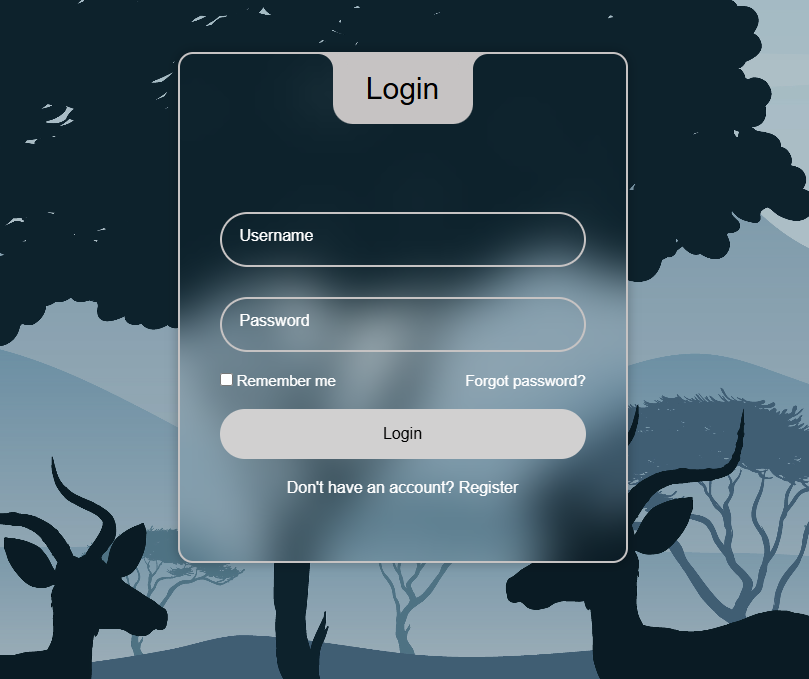
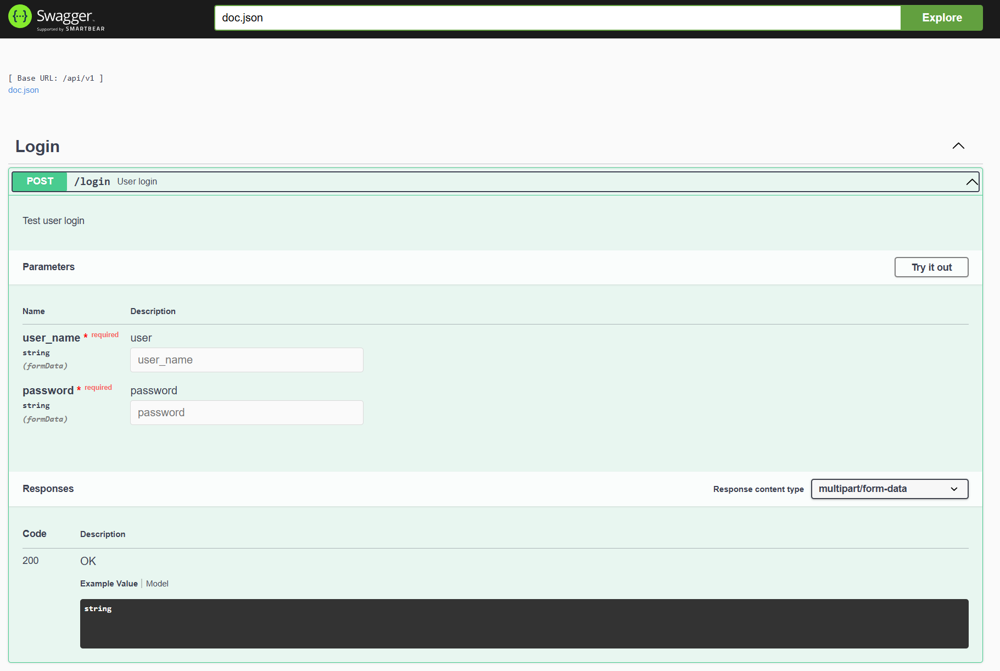
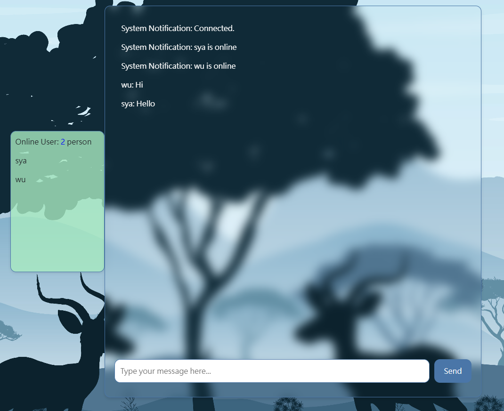

# Web-Login (Chat Room)
聊天室登入系統全端

## ✨ Feature
- 透過 Nginx將前後端分離
- 建立 RESTful API style
- 使用 Gin swagger 建立 API document
- 使用 Enviroment files 控制環境變數
- 使用 Docker compose 部署至正式環境
- 使用 GO gin 建立網頁後端
- 使用 Go routine 以及 Go channel 建立聊天室

## 🏗️ Architecture

## 🎉 Demonstrate
### Front-End


### RESTful API (Gin Swagger)


### Chat Room


# Build Images

```shell
#建立back-end images
docker build . --file ./back-end/Dockerfile --tag web-login

#建立chat-socket images
docker build . --file ./chat-socket/Dockerfile --tag web-chat

#建立Nginx(front-end) images
cd nginx
docker build --tag web-page .
```

# Quick Start

啟動服務
```shell
#將example .env file移到與docker-compose.yml同目錄
cp ./example/env_example/.env.example .env

docker compose up -d
```

各服務頁面

```
Swagger
- http://127.0.0.1:8081/api/docs/index.html

MySQL
- http://127.0.0.1:8080/index.php

Login page
- http://127.0.0.1:8081/
```

關閉
```shell
docker compose down
```